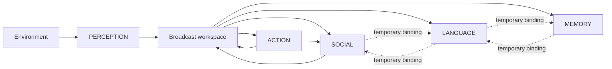
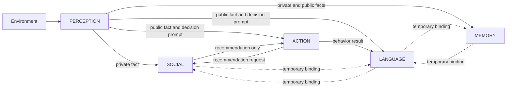

# Architecture Diagrams

## Condition A: Global Broadcast Control

All workspace-eligible events and inferences are sent to every other processor. Processors still retain private local state.

## Condition B: Differential Access

No processor can inspect another processor's local state. The temporary links transmit messages only and do not merge state.

# Side-by-Side Comparison

The neutral greeting at timestep 2 was identical in both conditions even though private knowledge already differed. Both selected `GREET_B`. This is a negative result showing that information asymmetry alone does not force behavioral divergence.

At timestep 3, public event `E3` reached SOCIAL in the global condition but not in the differential condition. In the global condition, SOCIAL replaced its earlier `avoid` interpretation with `welcome`. In the differential condition, SOCIAL retained the earlier private event `E1` as its local basis.

At timestep 4, ACTION used the same decision rule in both conditions. The global run produced `SURPRISE_B` because direct evidence and the social recommendation agreed. The differential run produced `ASK_B_FIRST` because ACTION received B's public `welcome` cue while SOCIAL supplied an `ASK_B_FIRST` recommendation generated from its stale local history.

The pre-binding LANGUAGE report also differed. In the global condition, LANGUAGE had received both social facts and the social recommendation. In the differential condition, LANGUAGE had B's public statement and the behavior result but lacked `E1` and the social recommendation. Its report therefore stated that it could not identify the missing social basis.

At timestep 6, a temporary communication window allowed LANGUAGE to query MEMORY and SOCIAL. Those processors transmitted explicit replies without state merging. The differential LANGUAGE report changed only after those messages arrived.

## Minimum causal pathway

The minimum pathway difference responsible for the final behavioral divergence is the failed `PERCEPTION -> SOCIAL` transmission of public event `E3` in the differential condition. That left SOCIAL's local state anchored to `E1`. The subsequent rules were identical across conditions.

## What This Experiment Actually Demonstrated

Direct observation: persistent, deterministic information asymmetry produced a structured divergence in processor-local state, a later divergence in SOCIAL recommendation, a later divergence in ACTION behavior, and an incomplete pre-binding LANGUAGE account. The same asymmetry did not alter the earlier neutral greeting. Opening a temporary communication pathway later changed what LANGUAGE could report.

Interpretation: this is evidence for the narrow claim that persistent differential access can be sufficient to create temporally structured behavior and report differences. It is not evidence that those effects are conscious, sentient, uniquely human, or intrinsically lifelike.

Alternative explanation: a conventional centralized program with a few hidden variables could reproduce the same observable pattern. The experiment therefore does not show that distributed private processors are necessary. It shows that when private state and explicit routing are genuinely enforced, information-pathway differences alone are sufficient to produce the measured effects in this toy scenario.

# Analysis

## Result

The narrow hypothesis receives limited support as an existence proof. The experimental condition produced a structured, persistent consequence of routing rather than random degradation. The final behavior differed (`SURPRISE_B` versus `ASK_B_FIRST`), the language system initially lacked the causal social context, and later explicit communication changed its report.

The null hypothesis, interpreted as claiming that persistent differential access produces no meaningful difference beyond trivial missing-information errors, is weakened by this run because the missing transmission changed another processor's retained state, which changed a later recommendation, which changed ACTION under an unchanged action-selection rule.

This does not establish a broad claim about lifelikeness. The scenario is deliberately constructed to expose the consequences of asynchronous local histories, and a centralized implementation with hidden flags could reproduce the same behavior. The stronger claim that persistent information asymmetry is a uniquely useful or necessary source of lifelike cognition remains unresolved.

## Falsification check

The effect is not solely a LANGUAGE deprivation artifact because ACTION behavior also diverged at timestep 4. The earlier neutral greeting remained identical despite different private knowledge, which is a useful negative case. No random withholding was used. Routing was deterministic and fixed by message type and channel. No LLM, affect system, planner, vector store, neural model, or DUCK subsystem was used.

## Causal account

`E1` created an initial asymmetry. That asymmetry did not alter the neutral action. At timestep 3, the control broadcast delivered `E3` to SOCIAL while the differential topology blocked that route. SOCIAL therefore held `welcome` in control and retained `avoid` in the experimental condition. At timestep 4, both ACTION processors received the same current public evidence and used the same selection rule. The only behaviorally relevant difference was the SOCIAL recommendation caused by its different local history.

Before temporary binding, differential LANGUAGE had `E3` and the ACTION result but neither `E1` nor the SOCIAL recommendation. After explicit context messages from MEMORY and SOCIAL, its available information changed and its report changed. No processor inspected the researcher trace or objective ground truth.

## What This Experiment Actually Demonstrated

The prototype directly demonstrates that deterministic routing can preserve different local histories across processors long enough to alter a later recommendation, alter behavior, and produce a discrepancy between the information available to the acting and reporting subsystems. It also demonstrates that not every private-state difference changes behavior, and that later communication can repair an informational gap without merging processor states.

The prototype does not demonstrate consciousness, sentience, repression, subconscious motivation, human-style confusion, or a uniquely biological mechanism. It also does not establish that this architecture is superior to centralized hidden-state implementations. Those remain viable alternative implementations of the same causal structure.
